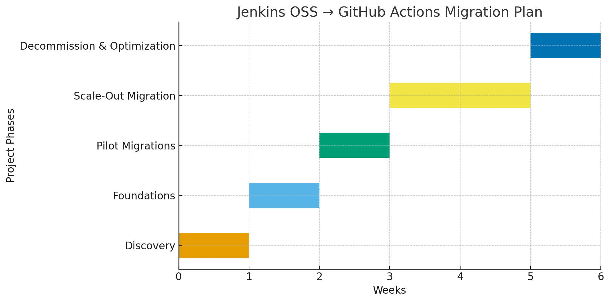

Here’s a basic project plan you can use as a starting point for a Jenkins OSS → GitHub Actions migration. 

# Project Plan: Migration from Jenkins OSS to GitHub Actions

## Objective
Migrate existing Jenkins OSS instances and pipelines to GitHub Actions in order to reduce operational overhead, improve security through OIDC federation, and provide standardized CI/CD workflows across all teams.

---

## Phases & Activities

### Phase 1 – Discovery (Week 0–1)
- Inventory Jenkins controllers, active jobs, shared libraries, and plugins.  
- Identify high-priority pipelines (build, test, deploy).  
- Document current credential management (AWS keys, Azure service principals, Vault, etc.).  
- Assess build environments needed (Linux, Windows, macOS, GPU).  
- Define governance requirements (approvals, compliance, audit).  

**Deliverables**: Migration inventory, plugin-to-actions mapping, initial risk log.

---

### Phase 2 – Foundations (Week 1–2)
- Configure OIDC providers in AWS accounts and Azure subscriptions.  
- Create GitHub Environments (dev, staging, prod) with secrets and approvals.  
- Stand up runners:  
  - GitHub-hosted runners for standard jobs.  
  - Self-hosted/ARC runners for private-network or custom workloads.  
- Develop starter reusable workflows for common build/test/deploy patterns.  

**Deliverables**: Working cloud federation, baseline runner infrastructure, starter workflow library.

---

### Phase 3 – Pilot Migrations (Week 2–3)
- Select 3–5 representative pipelines across different teams.  
- Migrate pipelines with minimal change (lift-and-shift).  
- Validate deployments to AWS and Azure using OIDC.  
- Collect feedback from pilot teams and refine reusable workflows.  

**Deliverables**: Successful pilot pipelines, feedback report, updated starter workflows.

---

### Phase 4 – Scale-Out Migration (Week 3–5)
- Migrate pipelines team by team, leveraging reusable workflows.  
- Replace Jenkins shared libraries with GitHub composite actions or workflows.  
- Provide training, docs, and office hours for developers.  
- Keep Jenkins in read-only mode for rollback reference.  

**Deliverables**: Majority of pipelines migrated, teams enabled, Jenkins phased out.

---

### Phase 5 – Decommission & Optimization (Week 5–6)
- Decommission Jenkins controllers and shared infrastructure.  
- Finalize governance (rulesets, required checks, dependency/secret scanning).  
- Optimize workflows with caching, artifacts, and parallel jobs.  
- Conduct post-migration review: lessons learned, cost analysis, adoption metrics.  

**Deliverables**: Retired Jenkins environment, hardened GitHub org-level governance, migration report.

---

## Risks & Mitigation
- **Secrets exposure** → Use OIDC, limit long-lived credentials.  
- **Network-bound jobs** → Deploy self-hosted/ARC runners in private VPCs.  
- **Team adoption challenges** → Provide reusable workflows, training, and support.  
- **Performance gaps** → Use caching and right-size runners.  
- **Timeline pressure** → Pilot first, then scale with predictable rollout.  

---

## Estimated Timeline
- **Week 0–1**: Discovery & inventory.  
- **Week 1–2**: Foundations (OIDC, runners, starter workflows).  
- **Week 2–3**: Pilot migrations.  
- **Week 3–5**: Scale-out to all teams.  
- **Week 5–6**: Decommission Jenkins, optimize & finalize.  

Total: ~6 weeks (phased, parallelizable across teams).

---

## Success Metrics
- 100% of pipelines migrated from Jenkins to GitHub Actions.  
- Zero security regressions; all deployments use OIDC.  
- Reduced operational overhead (no Jenkins controllers to patch/maintain).  
- Improved governance (enforced required checks, centralized secrets).  
- Positive developer adoption feedback (measured via surveys).  

---
## Gantt Chart Example
Here’s the Gantt chart for the Jenkins OSS → GitHub Actions migration plan. It shows each phase mapped across the 6-week timeline:

• **Week 0–1**: Discovery
• **Week 1–2**: Foundations
• **Week 2–3**: Pilot Migrations
• **Week 3–5**: Scale-Out Migration
• **Week 5–6**: Decommission & Optimization